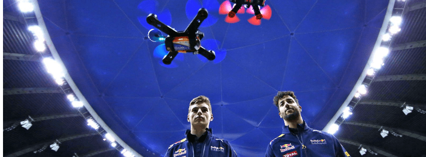

# Long-Term Planning with Deep Reinforcement Learning on Autonomous Drones



*In this paper, we study a long-term planning scenario that is based on drone racing competitions held in real life. We conducted this experiment on a framework created for "Game of Drones: Drone Racing Competition" at NeurIPS 2019. The racing environment was created using Microsoft's AirSim Drone Racing Lab. A reinforcement learning agent, a simulated quadrotor in our case, has trained with the Policy Proximal Optimization(PPO) algorithm was able to successfully compete against another simulated quadrotor that was running a classical path planning algorithm. Agent observations consist of data from IMU sensors, GPS coordinates of drone obtained through simulation and opponent drone GPS information. Using opponent drone GPS information during training helps dealing with complex state spaces, serving as expert guidance allows for efficient and stable training process. All experiments performed in this paper can be found and reproduced with code at our GitHub repository*


## [Long-Term Planning with Deep Reinforcement Learning on Autonomous Drones - Ugurkan Ates,July 2020]

https://sites.google.com/view/longtermplanrl

Note: If you use this repository in your research, please cite the pre-print.

```
@Article{ates2020longterm,
    title={Long-Term Planning with Deep Reinforcement Learning on Autonomous Drones},
    author={Ugurkan Ates},
    year={2020},
    eprint={2007.05694},
    archivePrefix={arXiv},
    primaryClass={cs.LG}
}

```

**Microsoft AirSim NeurIRS2019 Autonomous Drone Challenge implemented with Deep RL.**

You need to download environment binaries from https://github.com/microsoft/AirSim-NeurIPS2019-Drone-Racing
All code run & tested with Ubuntu 18.04 LTS, pyTorch with CUDA GPU.


*How to use in a Google Cloud Enviroment*

- Connect with SSH  (a new terminal appears) 
- After that click settings icon on right corner to a new Instance (we need 2 terminals)
- On first terminal to start simulation
- bash run_docker_image.sh "" training    OR  bash run_docker_image.sh "" training headless . Both seems same at this point
- on second terminal to code run.

    `cd /home/<username>/NeurIRS2019DroneChallengeRL/src/source`

    `python metest.py (for train code)`

    `python meplay.py(new code I added for playtesting)`

- It saves models if they get better in training then currently saved scores. You can also download .dat (model) files to normal local PC to see how it reacts. You can also see situtation from debug logs and you can save pictures


  

*Images taken by competitions website*

